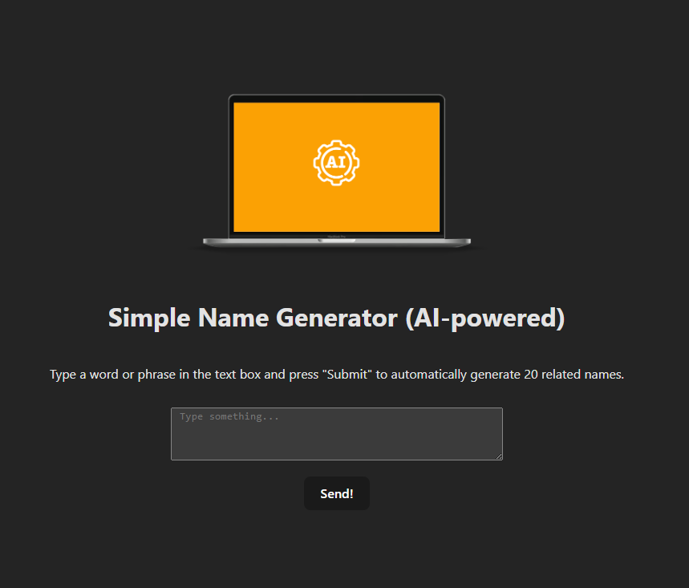

# Simple Name Generator (AI-powered)

This is a simple web app that uses an AI API to generate creative names based on a word or phrase you provide. Enter a word, press "Submit", and get 20 automatically generated names related to your input.



## 🌟 Features

- AI-generated name suggestions based on your input
- Clean and responsive user interface
- Easily customizable and extendable

## 🚀 Getting Started

### Prerequisites

- Node.js (v18+ recommended)
- A modern package manager like `npm` or `pnpm`
- API key from Geminis

## Environment Variables

This project uses environment variables to securely manage sensitive data such as API keys.

### Setup `.env` file

Create a `.env` file in the root directory of the project by copying the `.env.sample` file:

```bash
cp .env.sample .env
```

### Installation

```bash
git clone https://github.com/your-username/simple-name-generator.git
cd simple-name-generator
pnpm install
```
